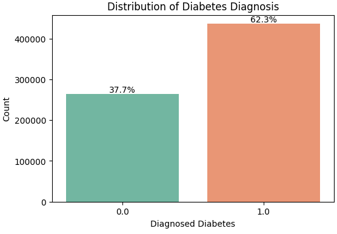

# Diabetes-Prediction

## Project Structure

```text
.
├── Data/
│   ├── test.csv
│   └── train.csv
├── Dockerfile
├── Images/
│   └── [screenshots and diagrams]
├── Notebooks/
│   ├── 1_Import_vs_Check_Data.ipynb
│   ├── 2_EDA_Notebook.ipynb
│   └── 3_Optuna_Hyperparameter_tuning.ipynb
├── README.md
├── Train_models/
│   ├── Load_final_model_cat.py
│   ├── Training_Models.ipynb
│   ├── Web_Service.py
│   ├── Web_Service_batch.py
│   ├── catboost_model.pkl
│   └── final_model_Catboost.py
├── requirements.txt
└── testcase_API.txt 
```

## Business Perspective:
Early detection of diabetes is critical for preventive healthcare. By predicting the probability that a patient will be diagnosed with diabetes, healthcare providers can:

* Identify high-risk patients early.
* Provide targeted lifestyle and medical interventions.
* Reduce long-term healthcare costs associated with untreated diabetes.

The goal is to turn patient health data into actionable insights, enabling data-driven decisions in clinical settings.

## Data Science Perspective:

From a data science standpoint, the challenge involves:
* Analyzing patient data (age, BMI, cholesterol, physical activity, family history, etc.).
* Feature engineering to improve model predictions.
* Modeling the probability of diabetes using supervised machine learning.

The key goal is to build accurate, interpretable predictive models that can generalize to new patients.

## Target Goal:

Predict the probability that a patient will be diagnosed with diabetes using the available dataset.

Predictions are probabilities (values between 0 and 1) rather than just a binary classification.

This allows healthcare providers to assess risk levels, not just yes/no outcomes.

## Machine Learning Models:

ML models help us:

* Identify complex patterns in patient health data.
* Make personalized predictions for each patient.
* Support clinical decision-making with probabilistic risk scores.
* Compare different algorithms to select the best performing model.

## Evaluation Criteria:

Submissions are evaluated using Area Under the ROC Curve (AUC-ROC):

* ROC Curve: Plots the true positive rate (sensitivity) vs the false positive rate (1 - specificity) for different probability thresholds.

* AUC (Area Under the Curve): Measures how well the model distinguishes between patients with and without diabetes.

Why AUC-ROC?

* It evaluates the quality of probability predictions, not just binary accuracy.

* A higher AUC indicates the model correctly ranks high-risk patients above low-risk patients.

* This is especially useful in healthcare where false positives and false negatives have different consequences.

## Dataset Overview:
The data comes from the [Playground Series S5E12 Kaggle competition.](https://www.kaggle.com/competitions/playground-series-s5e12)


Overview of the dataset. 
700000 rows and 25 columns


Column Description:


## EDA highlights:
More detail you can visit the 
[EDA Notebook](https://github.com/Khangtran94/Diabetes-Prediction/blob/main/Notebooks/2_EDA_Notebook.ipynb).

1. Mutual Information:


1. Heatmap Correlation:


1. Age vs Diabetes:


1. Physical Activity Minutes per Week:


1. Diet Score 


1. BMI


1. Blood Pressure


1. Family History


## Model Training vs Compare performance


I trained 3 models: XGBoost, LightGBM vs Catboost.
I use Optuna for hyperparameter tuning, please refer to [Optuna_Hyperparameter_tuning](https://github.com/Khangtran94/Diabetes-Prediction/blob/main/Notebooks/3_Optuna_Hyperparameter_tuning.ipynb).

* Confusion Matrix


* Classification Report


* ROC Curve


* Feature Importance:


* Cross-validation


=> Select CATBOOST model as final model

## Dependency and Environment Management:
1. Save final model as catboost_model.pkl
1. Create requirements.txt 
1. Create Dockerfile

## FastAPI Web Services
* Option 1: via FastAPI UI.

  * Run predict with Diabetes Prediction API (Batch Version) (this time I updated to not only single but also batch prediction).
    * Single patient:

    * Batch / Multiple patients:
    

* Option 2: Edit the JSON file in Load_final_model_cat.py then run via Terminal

Example 1


Example 2


## Build Docker Images


## Docker Hub:
Push Docker Image to Docker Hub:


You can follow this link to access to Diabetes Image on Docker hub: [](https://hub.docker.com/repository/docker/khangtranvn/diabetes-api/general)

